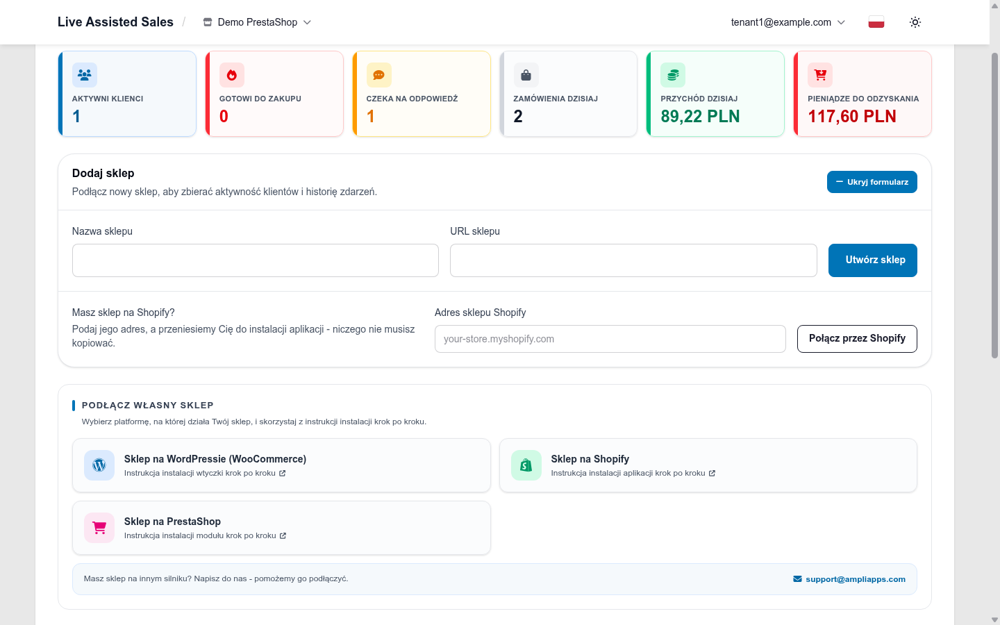
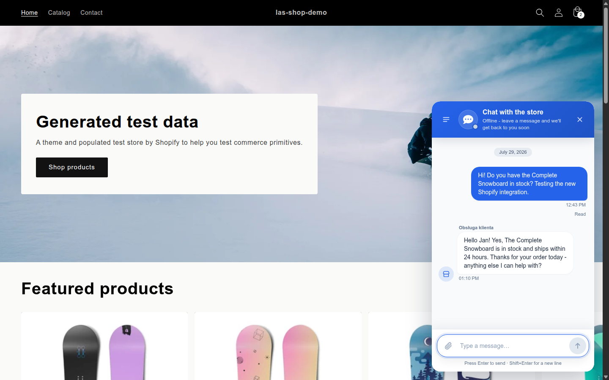

# AMPER Live Assisted Sales - Shopify app

**English** | [Polski](README.pl.md)

AMPER Live Assisted Sales connects your Shopify store to the [AMPER platform](https://live-assisted-sales.com), so you can watch visitors in real time, chat with them and grow your sales.

- **see in real time how many visitors are in your store** - what they view and search for, what they have in the cart and which orders they have placed,
- **know who to help first** - every visit receives a purchase-probability score (low / medium / high),
- **chat with your customers** - a chat bubble in the store, AI assistance, product suggestions and adding products to the cart without leaving the conversation,
- **respect your customers' privacy choices** - the integration honours your store's Shopify cookie-consent (Customer Privacy) settings; visitors who have not consented to analytics are not tracked in the browser.

An AMPER Live Assisted Sales account is required - once your store is connected, all features are available right away. The account is free and the first 7 days are a trial.

## What you need

- a store on Shopify (any plan; a free development store is fine for trying things out),
- access to the store's Shopify admin with permission to install apps and edit theme settings,
- internet access allowing communication with the AMPER platform.

There is nothing to download - the app installs straight from your AMPER LAS account.

## Step-by-step installation

1. Sign in (or create an account) at [live-assisted-sales.com](https://live-assisted-sales.com).
2. In the console open **My stores** and click **Add store**. In the form that unfolds, find the row **Is your store on Shopify?**, enter your store address (for example `your-store.myshopify.com`) and click **Connect via Shopify**.

   

3. Shopify opens your store's admin and asks you to approve the app installation. Review the permissions and click **Install**.
4. You will be brought back to live-assisted-sales.com. Confirm with **Connect this store** - the API keys, order webhooks and the analytics pixel are all set up automatically, nothing to copy or paste.
5. One last switch: click **Open the theme editor** on the confirmation page (or go to **Online Store → Themes → Customize** in your Shopify admin), open the **App embeds** panel, switch on **AMPER Live Assisted Sales** and save the theme.
6. Done. The chat bubble appears in your store, and the console at live-assisted-sales.com shows your traffic in real time. Orders are recorded automatically, even for visitors with ad blockers.

   

You can also start the installation with a direct link: `https://live-assisted-sales.com/integrations/shopify/install/?shop=your-store.myshopify.com` (replace the address with your own).

## Frequently asked questions

**Will the app slow my store down?**
No. The widget loads asynchronously and does not block page loads, browser events are sent in the background, and sales events (orders, checkouts) travel server-to-server between Shopify and the AMPER platform - they never depend on the visitor's browser.

**Do I need to keep an eye on updates?**
No. New versions are distributed by Shopify automatically - there is nothing to install or update in your admin.

**How do I pause sending data?**
On your store's settings page in the console, untick **Integration enabled**. Uninstalling the app in your Shopify admin (**Settings → Apps and sales channels**) also stops everything - your history stays in the console, and reconnecting the store switches the integration back on.

**Can I hide only the chat bubble?**
Yes. In the theme editor (**Online Store → Themes → Customize → App embeds → AMPER Live Assisted Sales**), untick **Show the chat bubble** - the bubble disappears, while visitor tracking and the live console keep working.

**What about my customers' data?**
The integration honours your store's Shopify cookie-consent (Customer Privacy) settings - without analytics consent, no behavioural data is collected in the browser. For details, see our [Terms of Service](https://live-assisted-sales.com/terms/) and [Privacy Policy](https://live-assisted-sales.com/privacy/).

## Support

Something not working, or have a question? Write to us: [support@ampliapps.com](mailto:support@ampliapps.com).

---

Technical documentation (development environment, tests, releasing, integration architecture): [DEVELOPMENT.md](DEVELOPMENT.md).
